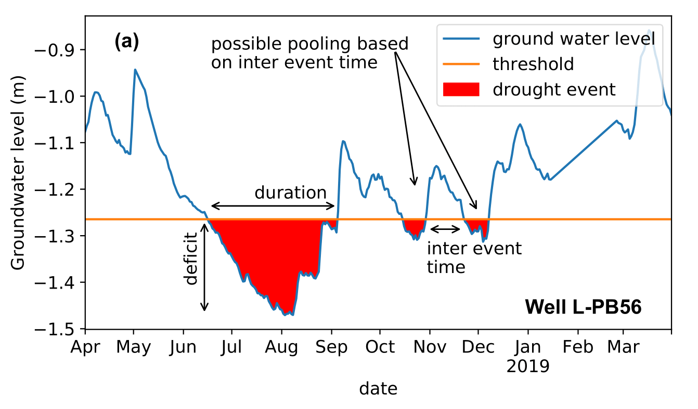
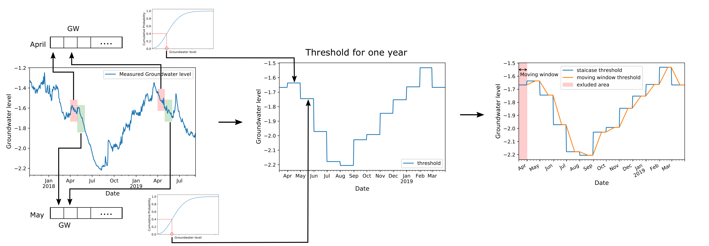

.. Draft documentation documentation master file, created by
   sphinx-quickstart on Thu Apr 14 13:15:52 2022.
   You can adapt this file completely to your liking, but it should at least
   contain the root `toctree` directive.

.. sectnum::

Welcome to Drought Threshold Method documentation!
=======================================================================

There are four drought characteristics: deficit, duration, frequency, and aerial extent. This package focuses only on the two
first ones (i.e. deficit and duration).  They can be estimated via (1) threshold method and (2) standardized indices such as SPI (Standardized Precipitation
Index). This package is only about threshold method. 

For the time being, the package includes three thresholds:

* fixed threshold,
* moving average of monthly quantile (variable threshold for short)
* 30-day moving window quantile (moving window for short).

Regarding the structure of the documentation, the first part is about the theoretical background (i.e. how deficit and duration are estimated and
how the threshold function is computed). Afterwards, application part is highlighted where examples of the class methods aree presented.

.. admonition :: Attention!

   For the time being, this package works only for daily data. Package would be able to handle hourly and
   monthly time steps in following versions.

.. toctree::
   :caption: Contents:

Here is `a link <http://www.example.com>`_ to somewhere.

See following code::

      a = 'b';

Theoretical Background
===============================================

Drought characteristics
----------------------------------------------

As for drought characteristics, for a flux variable, the severity metric is the sum of deficits
for a drought event where deficit is the subtraction of the hydrological flux from the threshold.
On the other hand, regarding a state variable, severity is the maximum variance from the threshold
during the drought event :ref:`Van Loon (2012) <Van_Loon>`.

  *Drought characteristics for a state hydrological variable*

It is worth mentioning methodology for threshold functions were derived by :ref:`Beyene (2014) <Beyene>`.

Fixed Threshold
-----------------------

Fixed threshold is a constant value based on a percentile considering the whole time series.

Variable Threshold
---------------------------------

To elaborate this technique, check the image below. The following steps are applied: (i) for each month of the year, a specific percentile (e.g. 20th) was
determined with the help of the cumulative distribution function (CDF) from all daily values in that month over all years, (ii) the value
of that monthly percentile was assigned to all days of the month, and (iii) backwards moving average of 20 days was applied to the whole year
to smooth the \'staircase differences\' and extinguish the abrupt jumps in threshold function between consecutive months.

  
  *Estimation of Variable Threshold function*

.. admonition :: Attention!

   For this threshold, data of 20 more days is required compared to fixed threshold which will be used to estimate backwards moving average.
   20 days of the input will not be included in the output.
	

Moving window Threshold
---------------------------------

As for the 30-day moving window quantile approach, for each time step a specific percentile (e.g. 20th one) was estimated
based on the GWLs which were measured 15 days before and 14 days subsequently to that time step (the size of the window was 30 days).
In that case, a centered moving average approach was applied and not a backwards one compared to variable threshold.

.. admonition :: Attention!

	For this threshold, data of 30 more days is required compared to fixed threshold. More specifically, 15  more days are required at the beginning
	of the input data and 15 days at teh end of it. These 30 days in total will not be included in the output. 
	

Pooling
----------------------------------------

Pooling is the process of merging drought events which occurred closely time-wise. It is common that one
large drought event is split into two or more events (of less magnitude) since water level exceeded the
threshold function for a limited number of time steps (see Figure XX). Therefore, instead of using one large
drought deficit and duration, two (or even more) lower values of deficit and duration are used.
This can lead to underestimation of deficit and duration in case the average
values of a specific period are estimated.

There are many pooling techniques available but only inter-event time method was applied in the current package.
When the difference between the start time of i+1 drought event and the end time of i drought event was lower
than a specific threshold, pooling was conducted.

Application
===============================================

Example for fixed threshold
----------------------------------------
Draft

Example for variable threshold
----------------------------------------

Example for moving window
----------------------------------------

Exceptions
===============================================

.. _references:

References
===============================================

.. _Beyene:

Beyene, B. S., Van Loon, A. F., Van Lanen, H. A. J., & Torfs, P. J. J. F. (2014).
Investigation of variable threshold
level approaches for hydrological drought identification.
Hydrology and Earth System Sciences Discussions, 11(11), 12765-12797.

.. _Van_Loon:

Van Loon, A. F., & Van Lanen, H. A. (2012). A process-based typology
of hydrological drought. Hydrology and Earth System Sciences, 16(7), 1915-1946.